# Лабіринт

#### Опис


Ми продовжуємо нашу подорож по Стародавній Греції та сьогодні за допомогою циклів створимо з вами лабіринт🗺


## Згадаймо🤔

1. Де було побудовано Олександрійський маяк?&#x20;
2. Навіщо було побудовано маяк і чому саме там?&#x20;
3. Якої висоти був Олександрійський маяк?&#x20;
4. За допомогою яких основних елементів вам вдалося його побудувати?

## Сьогодні ми:

1. Створимо схему лабіринту в Google Документах
2. Зробимо основні коридори лабіринту
3. Зробимо проходи і загородження в лабіринті
4. Зробимо лабірінт за допомогою циклу

> **Усі ці навички обов'язково знадобляться під час виконання вашого проєкту!**😉

## Основні завдання


Як вам уже відомо, греки були чудовими інженерами і стратегами. Тому сьогодні ми з вами будемо оптимізувати процеси і придумувати стратегії дій


## Лабіринт

Сформуємо схему майбутнього лабіринту. Для цього використаємо файл Google документів.


Якщо ви не володієте навичками роботи із Google-документами, пройдіть курс **IT-Independence**, безкоштовний для учнів GoITeens


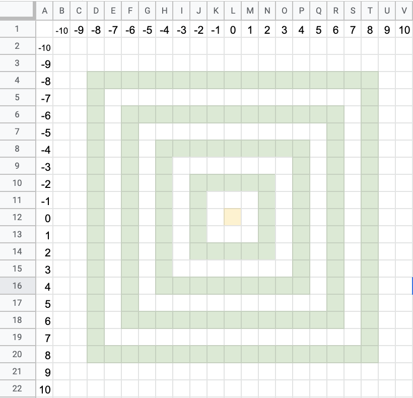

### Основні коридори лабіринту

| Внутрішній блок 1 | 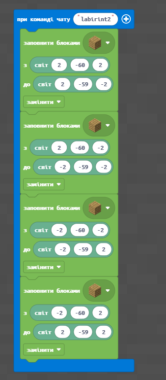       |        |
| ----------------- | --------------------------------- | ----------------------------------------- |
| Внутрішній блок 2 | .png>) | .png>) |
| Внутрішній блок 3 | 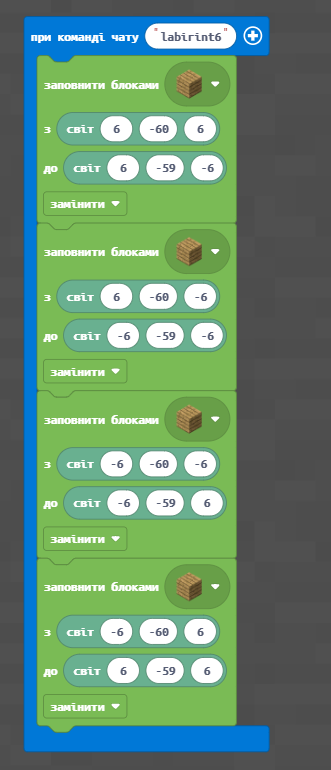       | 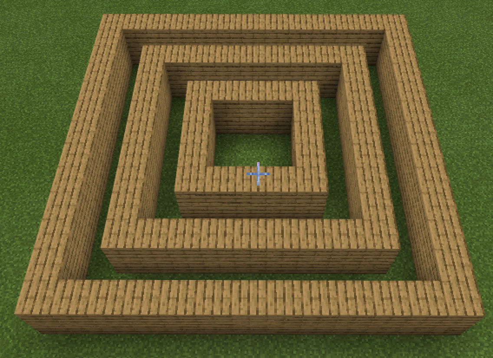       |
| Внутрішній блок 4 | .png>) | 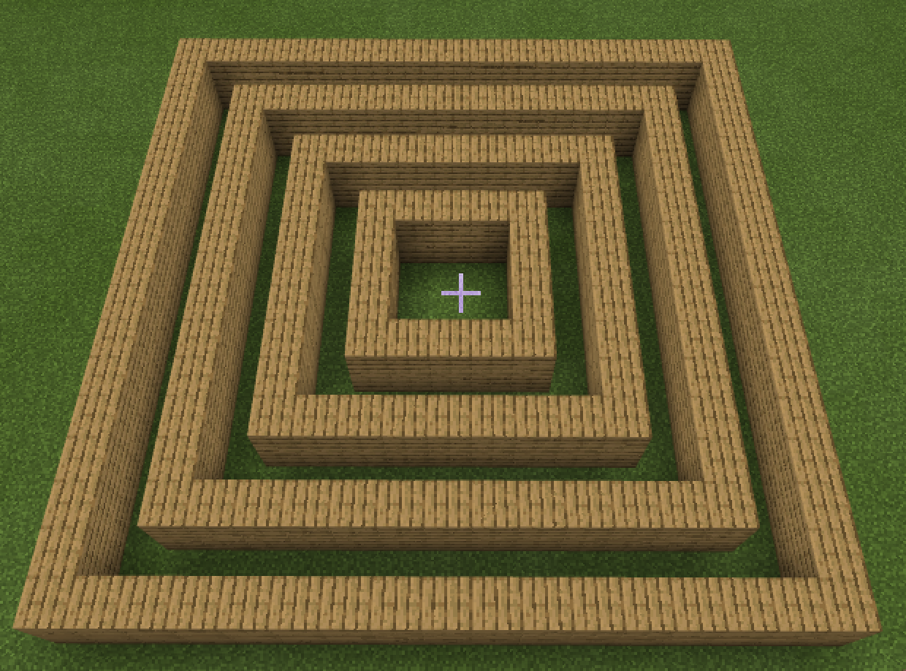       |

## Творчі завдання

1\) Зробіть заготовку для лабіринту із 4-х квадратів (елементи **різними кольорами**):

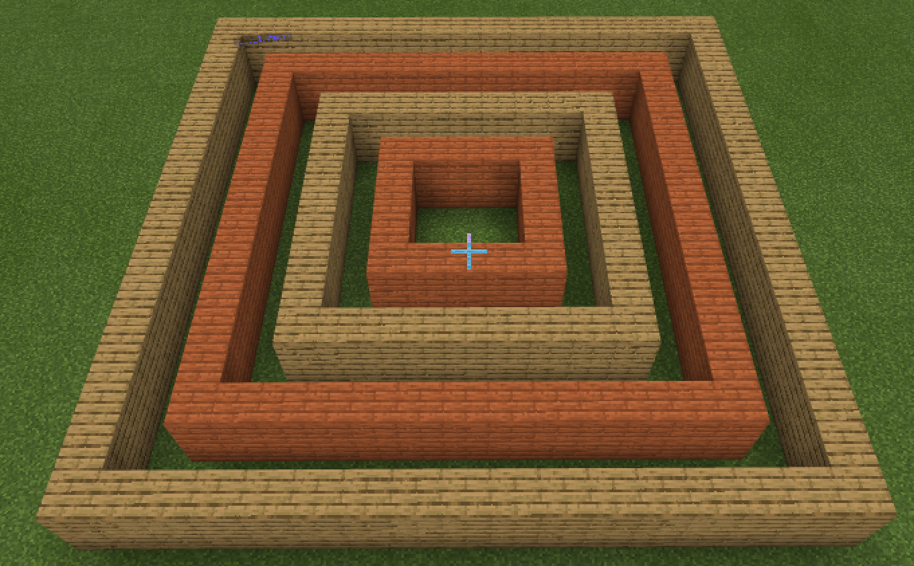

2\) Зробіть заготовку лабіринту із 4-х квадратів навколо точки **(20;4;20)**

3\) Зробіть заготовку лабіринту із 5-и квадратів навколо точки **(-20;4;-20)**

## Проходи і загородження

### План

Намалюємо в створених контурах проходи між ними (щоб можна було переходити з першого контура на другий, з другого на третій). А також поставимо загородження в кожному рівні.

.png>)

Реалізуємо цю карту за допомогою коду: створимо проходи між рівнями та загородження.

| Прохід у 1-му контурі (внутрішньому) | .png>) | .png>) |
| ------------------------------------ | --------------------------------- | -------------------------------------- |
| Прохід у 2-му контурі                | 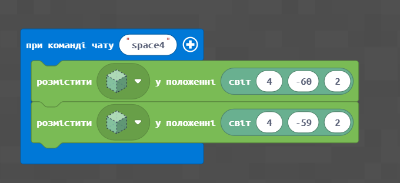       | .png>) |
| Прохід у 3-му контурі                | 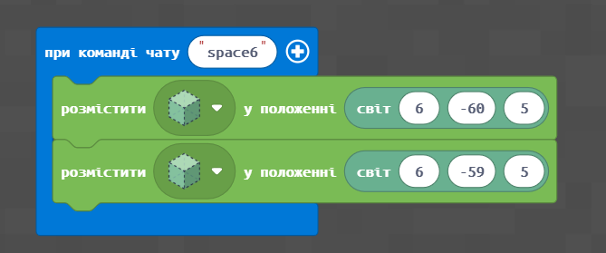       | .png>) |
| Прохід у 4-му контурі (зовнішньому)  | 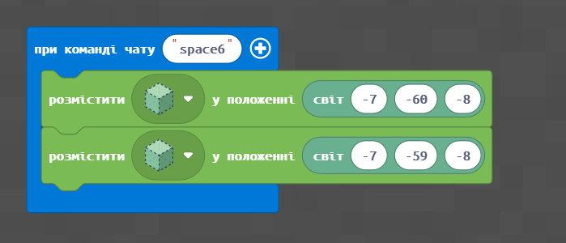       | .png>) |

## Творчі завдання

1. Зробіть лабіринт з **4-х** контурів навколо точки **(20;4;20)** та поставте **проходи** між контурами за власним вибором
2. Зробіть лабіринт з **5-и** контурів навколо точки **(-20;4;-20)** та поставте **проходи** між контурами за власним вибором

## Загородження

Для того, щоб лабіринт був більш складним — закриємо наскрізний прохід по кожному з контурів.

| Загородження у 1-му контурі (внутрішньому) | 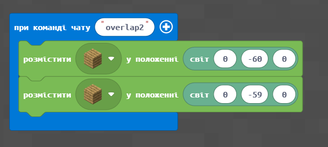 | .png>)  |
| ------------------------------------------ | --------------------------- | -------------------------------------- |
| Загородження у 2-му контурі                | 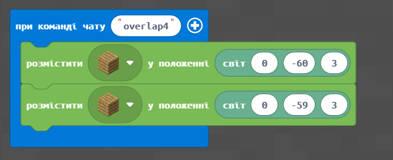 | .png>) |
| Загородження у 3-му контурі                |  | .png>)  |
| Загородження у 4-му контурі (зовнішньому)  | 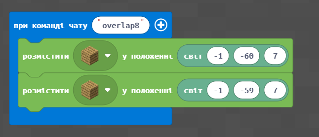 |                                        |

## Використання циклів


Попереднє завдання займає багато блоків. І якщо його переписати (на мові програмістів це називається _рефакторінг_) із використанням циклів, то можна значно скоротити кількість блоків.


Замість цих

|                                   |                             |
| --------------------------------- | --------------------------- |
| .png>) | 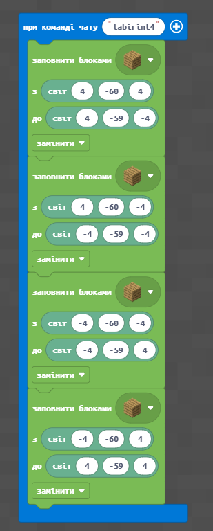 |
| .png>) | 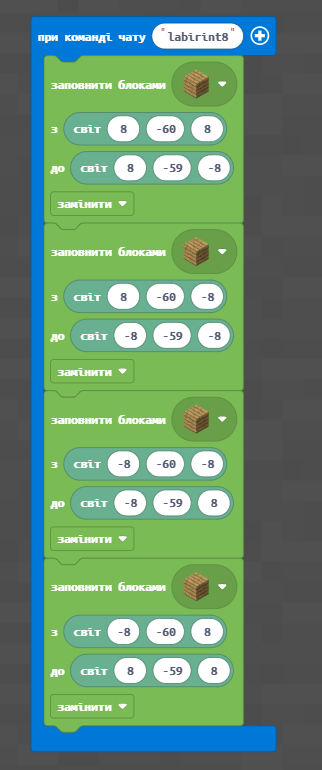 |

Зробимо цикл

|                             |                                        |
| --------------------------- | -------------------------------------- |
| 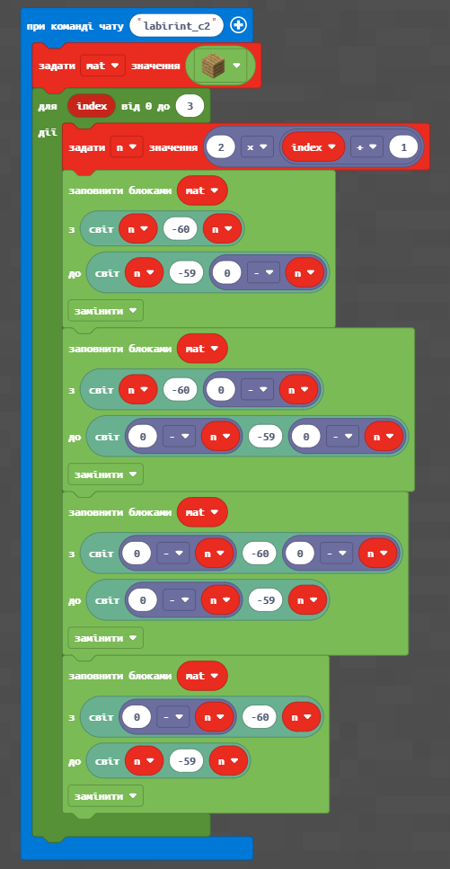 | .png>) |

## Додаткове завдання

Окрім того, що ми використвуємо цикли, ми можемо в залежності від номеру проходу циклу (значення змінної **index**) змінювати матеріал, з якого робимо відповідні елементи.

|                                                                                               |                                        |
| --------------------------------------------------------------------------------------------- | -------------------------------------- |
| 
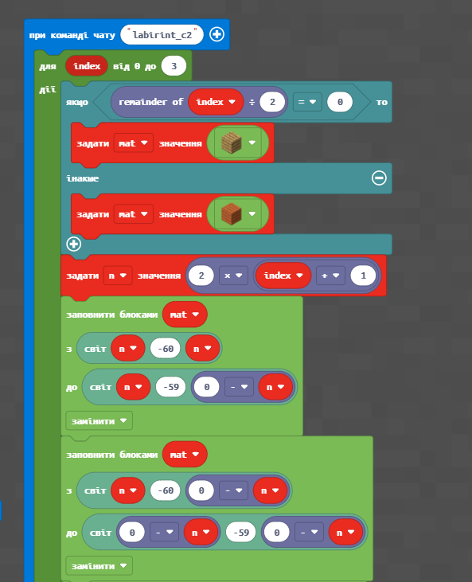 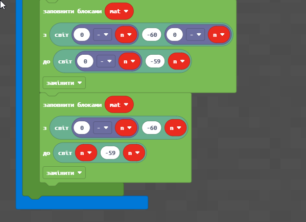
 | .png>) |

## Творче завдання

Для стврення проєкту власного лабіринту використайте заготовку за посиланням: [Заготовка лабіринту](https://docs.google.com/spreadsheets/d/1YTkfpzDfgZiIFWdcG07Nmok5ZMHS7TFatgf3W-VLPBY/edit#gid=1625087866)

Для цього **скопіюйте документ собі** (ви маєте бути авторизовані під обліковим записом Google, якщо ви підключені до Google.Meet зазвичай так і є):

.png>).png>)

### Проходи

Проходи між рівнями позначте білим тлом ячейок

.png>).png>)

Додайте відповідний блок команд для створення проходу в Майнкрафті:

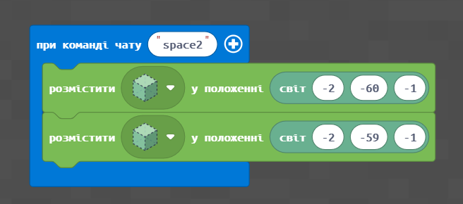

.png>).png>)

Додайте відповідний блок команд для створення проходу в Майнкрафті:

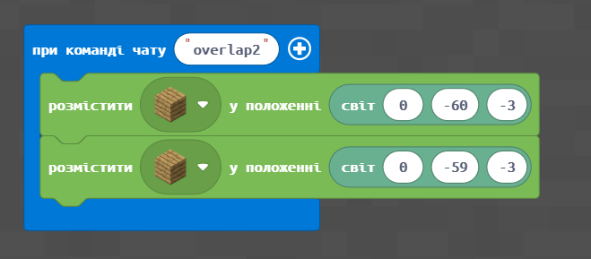

1. Сформуйте план лабіринту та створіть Лабіринт з **2-х контурів.**
2. Сформуйте план лабіринту та створіть Лабіринт з **4-х контурів**.
3. Сформуйте план лабіринту та створіть Лабіринт з **5-и контурів**.


На наступному занятті ми продовжимо подорож по Стародавньою Грецією, і ви отримаєте навички, які знадобляться при виконанні вашого проєкту!😉

